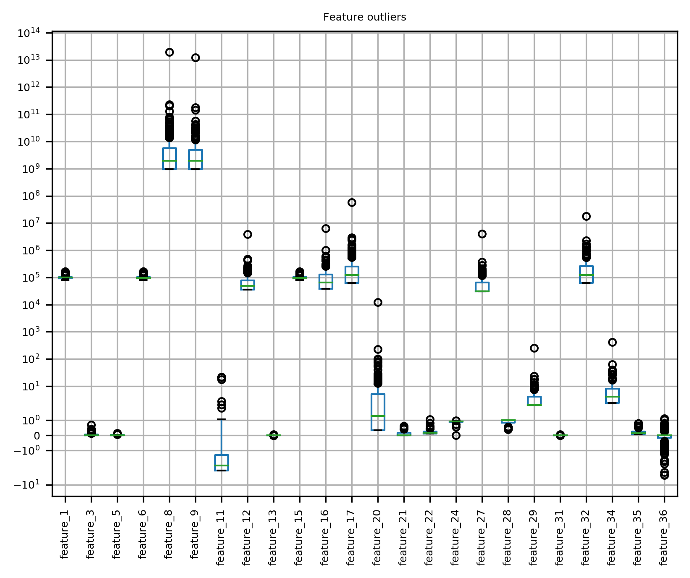

# Processing a heterogeneous feature matrix with pandas

We introduce a simple class `JsonData` that
encapsulates methods for processing a heterogeneous feature matrix
in JSON format with `pandas`.

The processing features can be outlined as follows:

* Read data from JSON file.
* Transform to `pandas` dataframe.
* Save the data to `csv` format.
* Homogenize the data.
* Evaluate basic statistics on the data.
* Evaluate and visualize outliers.
* Apply dimensionality reduction on the data.

In order to facilitate parallel processing a script is provided under
`bin/process_bulk_json_data.py` that currently wraps a simple
pipeline that converts data to `csv`.

## On the data

Note that the data are treated as a black box. They merely provide a use-case
of an heterogeneous matrix, that facilitates the demonstration of the various
utilities developed herein.


## Setup

### System requirements

* `make`
* `tkinter`
* `python3 (>=3.6)`

### Prepare development environment

1. Clone the repository and change directory inside.

2. Create virtual environment

   ```
   $ make install
   ```

3. Activate virtual environment

   ```
   $ source venv/bin/activate
   (venv) $
   ```

## Instantiating

Objects of the `JsonData` class are instantiated by passing
the JSON filename to the constructor.

```python
from processors import JsonData

data = JsonData('data.json')
```

## Features


### Read raw data

The raw data are read while trying to get the `JsonData.raw` property.

### Transform to dataframe

The dataframe representation of the raw data is exposed through
`JsonData.df` that caches the results of the `JsonData.to_df`
method.

### Save to csv

The dataframe is serialized to csv with the `JsonData.to_csv`
method. To this end, multi-valued features are flattened
through the `JsonData.transform_vector_features` method.

### Homogenize the data

`JsonData` supports dynamic transformation of multi-valued features
of the matrix through the `transform_vector_features` instance method.

By default, the latter method reduces the vector features to their
norm. This is the case when `JsonData.homogeneous_df` is evaluated.

### Evaluate basic statistics

Feature statistics are exposed through the `JsonData.stats` property
that wraps the `pandas.DataFrame.describe` method.

`JsonData.stats` shows the statistics of `JsonData.homogeneous_df`.

### Evaluate and visualize outliers

The outliers are first evaluated explicitly through the
`JsonData.evaluate_outliers` method.

In this context, null or infinite values in `JsonData.homogeneous_df`
are filled with values that lie outside the outer fences of each
feature. This result is cached in the `JsonData.filled_df` property.

The `JsonData.outliers` property exposes the filled feature values
of those features that actually have values outside the respective outer
fences.

Finally, the outliers for any subset of the features can be visualized
in a boxplot through the `JsonData.plot_outliers` method.



### Processing a large set of files

A script to perform a prescribed processing pipeline for a set of files
in parallel is available in `bin/process_bulk_json_data.py` that can be invoked
through

```
(venv) $ python -m bin.process_bulk_json_data [--dir <directory-of-json-files>] [--workers <number-of-parallel-workers>]
```

All files to be processed should be placed in specific directory. For testing
purposes you can generate any number of copies of the original `data.json` files
inside a `data/` directory with

```
$ source generate_data.sh [<number-of-copies>]
```

### Dimensionality reduction

Finally `JsonData` allows for the dimensionality reduction of the original
feature matrix through `sklearn.decomposition.PCA`. The feature matrix
is first scaled through `sklearn.preprocessing.StandardScaler`.

The task can be performed through the `JsonData.reduce_dimensions` method,
which updates `JsonData.pca` and `JsonData.scaler` to allow for future
postprocessing (e.g. inverse transform).

#### A side-note on the expected benefits

Dimensionality reduction effectively reduces the dimension of the feature
space, so that we expect:

1. Better classification performance by mitigating the "curse of dimensionality"
2. Time- and space-complexity improvements.

The dimension of the feature space for the example we examine (i.e. `data.json`) can be reduced
from 37 to only 7:

```python
>>> import numpy as np
>>>
>>> cumsum = np.cumsum(data.pca.explained_variance_ratio_)
>>>
>>> len(cumsum[cumsum <= .96])
7
>>>
>>> len(data.df.columns)
37
```

That is, seven principal components suffice to model about 95% of the variance of the original data. This implies about 80% less operations in any matrix calculation, whereas similar gains in memory usage are to be expected.
